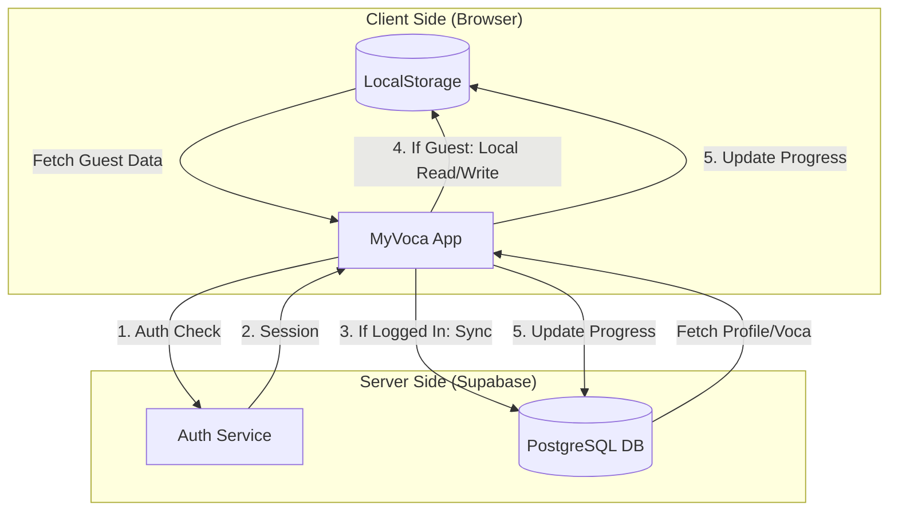

# MyVoca 데이터 흐름 설계 (Supabase 연동)

이 문서는 Supabase 데이터베이스와 연동된 새로운 데이터 흐름 및 구조 설계를 설명합니다.

## 1. 데이터베이스 테이블 매핑
현재 앱의 기능을 Supabase 테이블과 다음과 같이 매핑합니다.

| 기능 | 기존 (LocalStorage) | 변경 (Supabase) |
| :--- | :--- | :--- |
| 사용자 프로필 | `nick` | `User.nick` |
| 학습 데이터 매핑 | `wordMap` | `Voca` 테이블 (+ `day_number` 컬럼 추가 제안) |
| 학습 통계 | `userData` | `Voca` 테이블 집계 (Aggregate) 및 `User` 가입일 |
| 단어 마스터 데이터 | `resources/data.json` | `Word` & `Definition` 테이블 |

## 2. 데이터 흐름 다이어그램 (Visual Flow)

## 3. 세부 데이터 플로우 (Data Flow)

### A. 사용자 가입 및 초기화 (Onboarding)
1. **닉네임 등록**: `User` 테이블에 `user_id` (Auth UID)와 `nick`을 저장합니다.
2. **학습 데이터 생성**:
   - `Word` 테이블에서 전체 단어 리스트를 가져옵니다.
   - 클라이언트 사이드에서 셔플링 후, `Day`별로 묶어 `Voca` 테이블에 `(user_id, word_id, day_number)` 형태로 대량 삽입(Upsert)합니다.

### B. 메인 화면 로딩 (Loader)
1. `App` 로더에서 `User` 정보를 가져와 닉네임 유무를 체크합니다.
2. `Voca` 테이블에서 사용자의 전체 학습 진행도(완료된 단어 수 / 전체 단어 수)를 계산하여 전달합니다.

### C. 단어장 및 학습 모드
1. **단어장 리스트**: `Voca` 테이블을 `day_number`로 그룹화하여 각 Day의 진행도를 표시합니다.
2. **학습 (Card/Quiz)**:
   - 선택된 `day_number`에 해당하는 `word_id`들을 `Voca` 테이블에서 조회합니다.
   - 각 `word_id`에 매칭되는 상세 정보를 `Word` 및 `Definition` 테이블에서 Join하여 가져옵니다.
   - 학습 완료 시 `Voca` 테이블의 `status`를 `true`로 업데이트합니다.

## 3. 개선된 상태 관리 (Proposed)
- **Supabase Client**: 전역에서 접근 가능한 싱글톤 클라이언트를 생성합니다.
- **Realtime**: (선택 사항) 다른 기기에서의 동기화를 위해 Supabase의 Realtime 기능을 활용할 수 있습니다.
- **Caching**: React Router의 `loader`와 `action`을 활용해 서버 사이드 데이터와 클라이언트 상태를 효율적으로 관리합니다.
