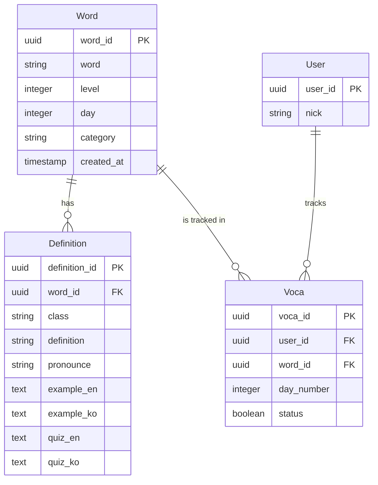

# MyVoca DB 스키마 명세서 (Database Schema Specification)

이 문서는 MyVoca 서비스의 핵심 데이터 모델 및 테이블 구조를 정의합니다.

---

## 1. 테이블 구조 (Table Structures)

### 1.1 Word (단어 마스터)
단어 그 자체를 관리하며, 학습 목표(레벨) 정보를 포함합니다.

| 컬럼명 | 타입 | 제약 조건 | 설명 |
| :--- | :--- | :--- | :--- |
| `word_id` | UUID | PK, Default: uuid_generate_v4() | 단어 고유 식별자 |
| `word` | String | NOT NULL, UNIQUE | 단어 스펠링 |
| `level` | Integer | NOT NULL, Default: 0 | 학습 목표 분류 (0: default, 800: 800점, 900: 900점) |
| `day` | Integer | NOT NULL, Default: 1 | 학습 차수 (Day) |
| `category` | String | - | 단어 테마 (예: 채용, 사무 환경) |
| `created_at` | Timestamp | Default: now() | 생성 일시 |

### 1.2 Definition (뜻 및 학습 데이터)
단어의 품사별 뜻과 예문, 퀴즈 데이터를 포함합니다. 한 단어는 여러 개의 뜻을 가질 수 있습니다.

| 컬럼명 | 타입 | 제약 조건 | 설명 |
| :--- | :--- | :--- | :--- |
| `definition_id` | UUID | PK, Default: uuid_generate_v4() | 뜻 고유 식별자 |
| `word_id` | UUID | FK (Word.word_id), ON DELETE CASCADE | 관련 단어 ID |
| `class` | String | NOT NULL | 품사 (n, v, adj, adv 등) |
| `definition` | String | NOT NULL | 단어의 뜻 |
| `pronounce` | String | - | 발음 기호 |
| `example_en` | Text | - | 영어 예문 |
| `example_ko` | Text | - | 한국어 번역 예문 |
| `quiz_en` | Text | - | 퀴즈용 영어 문장 (빈칸 포함) |
| `quiz_ko` | Text | - | 퀴즈용 한국어 해석 |
| `created_at` | Timestamp | Default: now() | 생성 일시 |

### 1.3 User (사용자 정보)
서비스를 이용하는 사용자 정보를 관리합니다.

| 컬럼명 | 타입 | 제약 조건 | 설명 |
| :--- | :--- | :--- | :--- |
| `user_id` | UUID | PK (FK to auth.users) | Supabase Auth 유저 ID |
| `nick` | String | - | 사용자 닉네임 |
| `created_at` | Timestamp | Default: now() | 가입 일시 |

### 1.4 Voca (사용자별 학습 상태)
사용자별로 어떤 단어를 학습했는지, 어떤 Day에 배정되었는지를 관리합니다.

| 컬럼명 | 타입 | 제약 조건 | 설명 |
| :--- | :--- | :--- | :--- |
| `voca_id` | UUID | PK, Default: uuid_generate_v4() | 학습 기록 고유 ID |
| `user_id` | UUID | FK (User.user_id), ON DELETE CASCADE | 사용자 ID |
| `word_id` | UUID | FK (Word.word_id), ON DELETE CASCADE | 단어 ID |
| `day_number` | Integer | NOT NULL | 배정된 학습 차수 (Day) |
| `status` | Boolean | Default: false | 학습 완료 여부 (true: 완료) |
| `last_learned_at`| Timestamp | - | 마지막 학습 일시 |

---

## 2. 관계도 (ERD)

---

## 3. 데이터 흐름 특징
- **마스터 데이터**: `Word`와 `Definition`은 모든 사용자에게 공통으로 노출되는 정적 데이터입니다.
- **학습 데이터**: `Voca` 테이블은 사용자 로그인 시 로컬 스토리지 데이터와 동기화되거나, 로그인 상태에서 실시간으로 업데이트됩니다.
- **조인 구조**: 단어 조회 시 `Word`를 기준으로 `Definition`을 `left join`하여 풍부한 정보를 제공합니다.
