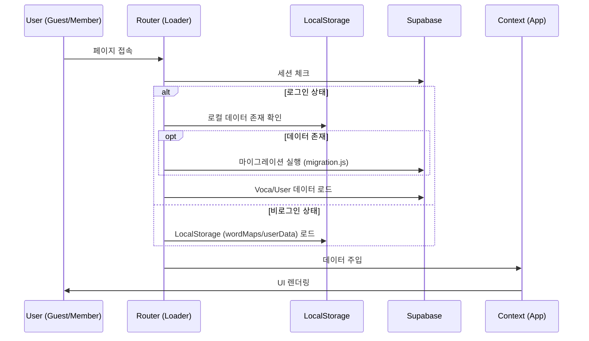

# MyVoca Service Architecture & Guide

본 문서는 MyVoca 프로젝트의 전체 서비스 구조와 핵심 설계 원칙을 에이전트에게 제공하기 위한 가이드입니다.

## 1. 서비스 계층 구조 (Service Layers)

MyVoca는 다음과 같은 4단계 계층 구조로 동작합니다.

### Layer 1: Router & Loaders (`src/router`)
- **역할**: URL 기반 페이지 전환 및 진입 전 필수 데이터 로드.
- **핵심 파일**:
  - `loadUserData.js`: 사용자 세션, 프로필, 학습 진행도(Voca) 데이터 로드 및 Guest 데이터 마이그레이션 처리.
  - `loadPlay.js`: 학습(Play) 페이지 진입 시 필요한 특정 Day의 단어 데이터 구성.

### Layer 2: Context & State (`src/context`, `src/hooks`)
- **역할**: 전역 상태 관리 및 비즈니스 로직 캡슐화.
- **핵심 파일**:
  - `WordDataContext.jsx`: 서버로부터 가져온 단어 마스터 데이터를 전역에서 접근 가능하도록 제공.
  - `useWord.jsx`: 현재 학습 진행 상태와 단어 맵을 연결하는 브릿지 로직.

### Layer 3: Pages & Components (`src/pages`, `src/components`)
- **역할**: UI 렌더링 및 사용자 인터랙션 처리.
- **주요 서비스**:
  - **Home**: 학습 통계 및 대시보드 표시.
  - **Voca**: 전체 단어 목록 조회 및 개별 단어 학습 상태 업데이트.
  - **Play**: 카드/퀴즈 방식의 실제 학습 인터페이스.

### Layer 4: Infrastructure & Utils (`src/utils`)
- **역할**: 외부 서비스(Supabase) 연동, 로컬 스토리지 제어, 공통 유틸리티 제공.

## 2. 핵심 데이터 흐름 (Core Data Flow)

## 3. 핵심 설계 규칙
1. **데이터 정규화**: `wordMaps`는 레벨별로 구분되며, 단어별 개별 상태는 `wordStatus` 객체로 관리하여 중복 집계를 방지함.
2. **이중화 지원**: 모든 핵심 로직은 로그인 유저(Supabase)와 Guest 유저(LocalStorage)를 동시에 지원해야 함.
3. **안전한 수정**: 유틸리티 함수 수정 시 반드시 `[Used In]` 명세를 확인하여 사이드 이펙트를 체크할 것.
