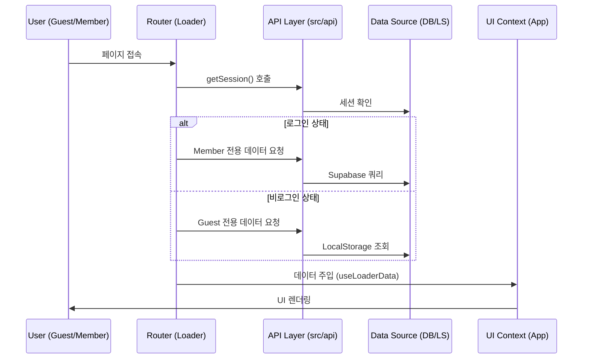

# MyVoca Service Architecture & Guide

본 문서는 MyVoca 프로젝트의 전체 서비스 구조와 핵심 설계 원칙을 에이전트에게 제공하기 위한 가이드입니다.

## 1. 서비스 계층 구조 (Service Layers)

MyVoca는 다음과 같은 4단계 계층 구조로 동작합니다.

### Layer 1: Router & Loaders (`src/router`)
- **역할**: URL 기반 페이지 전환 및 진입 전 필수 데이터 로드(Hydration).
- **핵심 파일**:
  - `src/router/user/index.js`: `loadUserData` (사용자 세션/프로필/학습 데이터 통합 로더).
  - `src/router/user/utils.js`: 데이터 가공용 순수 함수.

### Layer 2: API Layer (`src/api`)
- **역할**: 데이터 소스(Supabase, LocalStorage) 접근 로직 추상화 및 모듈화.
- **구조**:
  - `auth/`: 세션 및 인증 관리.
  - `user/`: 회원 프로필 및 학습 데이터(DB) 접근.
  - `guest/`: 게스트 스토리지(LocalStorage) 제어.
  - `voca.js`: 회원/게스트 통합 업데이트 인터페이스.

### Layer 3: UI & Components (`src/pages`, `src/components`)
- **역할**: UI 렌더링 및 사용자 인터랙션 처리. 로더로부터 주입받은 데이터를 `useOutletContext`를 통해 소비합니다.
- **핵심 훅**:
  - `useWord.jsx`: 현재 선택된 Day의 단어 리스트와 상태를 연결하는 브릿지.

### Layer 4: Infrastructure & Utils (`src/utils`)
- **역할**: 저수준 유틸리티(날짜 계산, 배열 셔플 등) 및 외부 라이브러리 설정.

## 2. 핵심 데이터 흐름 (Core Data Flow)

## 3. 핵심 설계 규칙
1. **로더 중심 데이터 처리**: 컴포넌트 내부의 `useEffect` 데이터 패칭을 지양하고, Router Loader에서 필요한 데이터를 미리 확보합니다.
2. **API 추상화**: UI 컴포넌트는 데이터 소스(DB vs LS)를 직접 알지 못하며, `src/api`에서 제공하는 통합 인터페이스를 사용합니다.
3. **JSDoc 의무화**: 모든 API와 유틸리티 함수에는 매개변수와 반환 타입을 명시하여 데이터 무결성을 보장합니다.
4. **순수 함수 지향**: 비즈니스 로직(가공, 필터링 등)은 부수 효과가 없는 순수 함수로 작성하여 `utils` 폴더에서 관리합니다.
